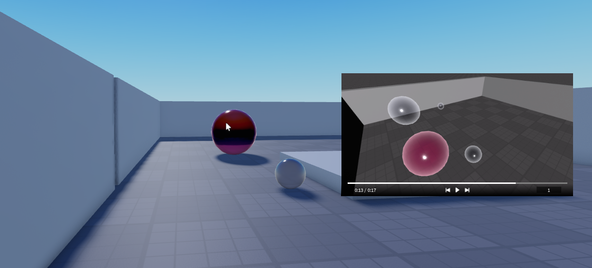

<h1 align="center">ReplayModule</h1>

<h3 align="center">this project is only being worked on sporadically. updates not guaranteed.</h3>

    

	<a href="https://github.com/xa1on/ReplayModule">💾 Github</a> | <a href="https://discord.gg/ecWpzSJQg2">📩 Discord</a>

## Features
- highly customizable and flexible save state replay system
- all active models are observed and recorded, even if they are generated during recording
- fast and efficient storage and replay (compared to the competition)
- custom types and a lot of very annoying typechecking
- custom viewport frame creator
- smooth interpolation

## WIP
- metatables to avoid creating new functions per replay created
- doubly linked-lists for storing frames (reference to previous change frame included for each new frame) REQUIRES MAJOR OVERHAUL OF PLAYBACK AND RECORDING
- ignoredescendents (dont add new descendents of activemodels)
- weld mode (rather than saving all the cframe data for all cframes, save weld data for parts connected to welds)
- record light & particle properties
- cache replay option (may or may not be a good idea considering the amount of data replays take)
- record value differences as opposed to storing the current value of each changing property to save memory (every 10 differences or so it should recalibrate and return the actual value)
- replay compression (lzw)
- replay serialization (base64)
- instance serializer (possibly rose?)
- plugin to insert replay
- generate moon animator animation for replay

## Maybe?
- utilize parent property instead of using custom IsDestroyed property
- storing timestamp of previous change to make going back faster on non-cached replays (doubly linked-lists will solve this issue)
- doing fps along with framefrequency (idk why you would need this but i guess it could be helpful for people who run at a higher fps?)
- chunking/task scheduler for playback/export
- cubic interpolation for cframes????? maybe???? constant or continuous speed curve to ensure consistency